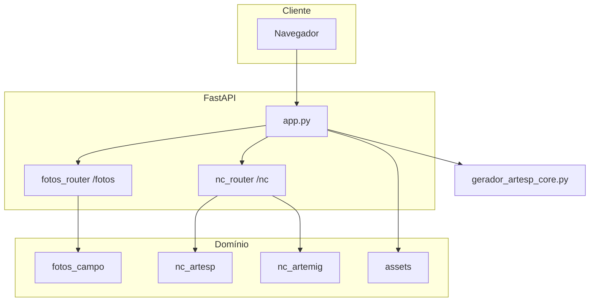

# Documentação do projeto — GeradorARTESP

Plataforma de **Conservação e Obras**: automação de relatórios **ARTESP / ARTEMIG**, integração **Kartado / Kria**, módulos **GeoJSON**, **Fotos de campo** e **NC (Não Conformidades)**. Servidor único **FastAPI** (`render_api`), com UI em `/web/...`.

Detalhe de payloads e listas completas de env: [render_api/README.md](render_api/README.md).

---

## Arquitetura

- **Monólito deployável:** um processo `uvicorn render_api.app:app` serve API JSON, HTML e estáticos.
- **Núcleo:** `render_api/app.py` (auth, GeoJSON, admin, rotas `/web`, montagem `/web-static`).
- **Routers:** `fotos_router` → prefixo `/fotos`; `nc_router` → prefixo `/nc`.
- **Domínio:** pacotes `nc_artesp`, `fotos_campo`, `nc_artemig`; geração GeoJSON também via `gerador_artesp_core.py` e `assets/schema`.
- **Disco:** `ARTESP_OUTPUT_DIR` / `outputs/` — artefactos; `ARTESP_DATA_DIR` / `data/` — `users.json`, métricas. **Jobs NC:** `outputs/nc/<job_id>/` com `input/`, `stage1/`, `stage2/`, `final/` (`render_api/job_manager.py`).
- **Lifecycle:** `lifespan` em `app.py` — sync utilizadores, limpeza periódica de ficheiros antigos em `outputs/`.



---

## Estrutura de pastas

| Pasta / ficheiro | Função |
|------------------|--------|
| `render_api/` | FastAPI: `app.py`, `nc_router.py`, `fotos_router.py`, `job_manager.py`, `auth_crypto.py`, `web/`, `web-static/`, `tests/`, `scripts/`. |
| `nc_artesp/` | Pipeline NC (M01–M08), PDF, e-mail, calendário, `config.py`, `modulos/`, `assets/templates`. |
| `nc_artemig/` | Lógica e templates **ARTEMIG** (ex.: lote 50). |
| `fotos_campo/` | Listagem e modelos Excel de fotos de campo. |
| `assets/` | Schemas GeoJSON (`schema/`), malhas, templates Excel por lote/modalidade. |
| `gerador_artesp_core.py` | Conversão Excel → GeoJSON (invocado pela API). |
| `docs/` | Notas técnicas (ex.: Excel). |
| `Dockerfile` | Build produção: GDAL/GEOS, `requirements.txt`, uvicorn. |
| `requirements.txt` | Dependências Python (raiz). |

Mapa de ficheiros referenciados pelo código: [MAPA_DE_DEPENDENCIAS.md](MAPA_DE_DEPENDENCIAS.md).

---

## Fluxos

### GeoJSON

1. **Simular** (`POST /simular`) — valida Excel contra o template; não gera GeoJSON final.  
2. **Upload** (`POST /geojson/upload`) — Excel → GeoJSON em `outputs/` (fluxo simplificado da UI).  
3. **Processar** (`POST /processar-relatorio`) — recebe `FeatureCollection` JSON → validação schema → ficheiro → assinatura opcional.

#### Registo e rastreio (como os dados foram gerados)

Para **auditoria** e para cumprir a ideia de “manter um registo do processo”, o projeto combina **metadados no próprio GeoJSON**, **ficheiros de acompanhamento** em `outputs/` (ou no ZIP de entrega) e **log na interface**.

| O quê | Onde / conteúdo |
|--------|------------------|
| **Metadados estruturados** | No ficheiro `.geojson`, objeto `metadata`: por exemplo `data_geracao` (RFC3339 com fuso), `schema_version`, `lote`, `gerador_versao`, flags de geração (ex. correção de eixo, geometria por sentido) quando o ficheiro é produzido a partir do Excel. Em `POST /processar-relatorio`, a API pode acrescentar `gerador_api` e `usuario_email`. |
| **Log de texto** | `{nome_base}_LOG.txt` na mesma pasta de saída: data/hora de geração, lote, modalidade, chave de versão, contagens (linhas Excel, features, pendências), resumo de motivos de pendência, **SHA256** do GeoJSON, do Excel e do schema, e resultado da validação. |
| **PDF de relatório** | `*_RELATORIO.pdf` (quando o ambiente tem `reportlab`): utilizador, parâmetros da geração, lista de ficheiros incluídos e referências de conformidade. |
| **Excel de resumo** | `*_RESUMO.xlsx` (quando há `openpyxl`): resumo protegido alinhado ao pacote gerado. |
| **ZIP de entrega ARTESP** | Inclui os artefactos acima numa árvore de pastas; é acrescentado **`README_AUDITORIA.txt`** com texto legível (utilizador, data, estrutura, checklist de conformidade e ligações de referência). |
| **Log em tempo real (UI)** | Na página GeoJSON, o fluxo com progresso (`/gerar-relatorio-progresso`) envia eventos SSE; o painel regista mensagens com hora. Comportamento descrito em [render_api/web/PADRAO_GEOJSON_REFERENCIA.md](render_api/web/PADRAO_GEOJSON_REFERENCIA.md). |

**Boas práticas:** guardar o **ZIP completo** ou a pasta do relatório (GeoJSON + LOG + PDF/XLSX quando existirem); não descartar o `_LOG.txt` se precisar de provar o que foi validado e quando; correlacionar `metadata.data_geracao` com o carimbo no LOG/PDF. Para submissões intermédias, pode usar-se um `nome_arquivo` explícito em `POST /processar-relatorio` (ver `render_api/README.md`).

### Fotos de campo

1. **Listar** (`POST /fotos/listar`) — ZIP de imagens → XLSX (metadados + GPS).  
2. **Coordenadas-km** (`POST /fotos/coordenadas-km`) — XLSX + Relação Total → rodovia/km.

### NC — pipeline automático (uma ou duas chamadas)

**Entrada típica:** EAF (.xlsx) + PDFs opcionais + lote.

**Ordem interna** (`/nc/completo`, `/nc/separar` com `entrega_completa=true`, ou `/nc/start` seguido de `/nc/stage2`):

1. **M01** — Separar NC → `stage1/nc_separados.zip`.  
2. **PDFs (opcional)** — extração de imagens no servidor.  
3. **E-mail** — rascunhos `.eml`.  
4. **M02** — Kria + Respostas pendentes.  
5. **Kartado** — pacotes ZIP se M01 em layout Kartado.  
6. **M04 + M06** — Acumulado.xlsx e `.ics`.  
7. **ZIP final** — pastas de entrega + `backup/` de imagens quando aplicável.

**Excluído do automático:** **M03** (Kcor conservação via inserir Kria); **M05** (coluna Y) manual se necessário.

### NC — Meio Ambiente (PDF)

`POST /nc/pipeline-meio-ambiente-pdf`: PDF MA → EAF MA → Kria/Resposta MA → Kcor-Kria MA (+ imagens; ZIP opcional de fotos).

### NC — etapas isoladas

Cada rota `POST /nc/...` pode corresponder a **uma** macro (M01–M08) ou utilitário (`analisar-pdf`, `extrair-pdf`, `criar-email`, …). Ver docstring de `nc_router.py` e [CONTRATO_FRONTEND_NC.md](render_api/CONTRATO_FRONTEND_NC.md).

### Jobs stateful

Com `job_id`, o servidor reutiliza o workspace entre pedidos (menos re-upload). Retenção maior quando pipeline encadeado vs. etapa isolada — ver `nc_router.py`.

---

## Rotas

### Páginas HTML (`GET`)

| Rota | Descrição |
|------|-----------|
| `/` | Redirecionamento para o módulo GeoJSON (`/web/geojson`). |
| `/web` | Alias útil para entrada GeoJSON (conforme `app.py`). |
| `/web/home` | Hub + login unificado. |
| `/web/geojson` | Gerador GeoJSON. |
| `/web/fotos` | Fotos de campo. |
| `/web/nc` | Pipeline NC. |
| `/web/admin` | Administração (métricas, utilizadores). |

Estáticos: **`/web-static/*`** (CSS, JS, ícones). Estilo base: `bloco-padrao.css`.

### Autenticação

| Método | Rota | Descrição |
|--------|------|-----------|
| POST | `/auth/login` | Email + senha → JWT. |
| POST | `/auth/logout` | Invalida sessão/token. |
| GET | `/auth/me` | Utilizador atual. |
| POST | `/auth/trocar-senha` | Troca de senha. |
| GET | `/auth/status-db` | Estado do armazenamento de utilizadores. |

### GeoJSON e ficheiros (núcleo `app.py`)

| Método | Rota | Descrição |
|--------|------|-----------|
| POST | `/simular` | Validação Excel. |
| POST | `/geojson/upload` | Excel → GeoJSON. |
| POST | `/processar-relatorio` | JSON GeoJSON validado + gravação + assinatura opcional. |
| GET | `/outputs/{arquivo}` | Download de artefactos (com auth conforme rota). |

Outras rotas Excel/GeoJSON (progresso, relatórios): ver `render_api/app.py` e [render_api/README.md](render_api/README.md).

### Admin e métricas

| Método | Rota | Descrição |
|--------|------|-----------|
| GET | `/admin/stats` | Estatísticas (admin). |
| GET | `/admin/check` | Verificação de permissão admin. |
| GET | `/admin/usuarios` | Listagem de utilizadores. |
| POST | `/admin/adicionar-usuario` | Criar utilizador. |
| POST | `/admin/redefinir-senha-usuario` | Redefinir senha. |
| GET | `/api/stats` / `/api/config` | Métricas/config expostas à UI. |

### Fotos (`/fotos`)

| Método | Rota | Descrição |
|--------|------|-----------|
| POST | `/fotos/listar` | ZIP → XLSX listagem. |
| POST | `/fotos/coordenadas-km` | Listagem → XLSX com km/rodovia. |

### NC (`/nc`)

Resumo — lista completa e descrições: **`GET /nc/`** (JSON com `endpoints` e `pipeline`) ou [render_api/README.md](render_api/README.md).

| Método | Rota | Descrição |
|--------|------|-----------|
| GET | `/nc/` | Info do módulo + lista de endpoints. |
| POST | `/nc/completo` | EAF + PDFs? → ZIP final (M01 + stage2). |
| POST | `/nc/start` | Só M01 → `job_id` + `stage1/nc_separados.zip`. |
| POST | `/nc/stage2` | `job_id` + ZIP imagens opcional → ZIP final. |
| POST | `/nc/separar` | M01 (+ pipeline completo por defeito ou só XLS). |
| POST | `/nc/extrair-pdf` | Imagens a partir de PDFs. |
| POST | `/nc/analisar-pdf` | Análise / relatório PDF. |
| POST | `/nc/pipeline-meio-ambiente-pdf` | Pipeline MA completo a partir de PDF. |
| POST | `/nc/gerar-modelo-foto` | M02 isolado. |
| POST | `/nc/inserir-conservacao` | M03. |
| POST | `/nc/inserir-meio-ambiente` | M07 isolado. |
| POST | `/nc/juntar` | M04. |
| POST | `/nc/inserir-numero` | M05. |
| POST | `/nc/exportar-calendario` | M06. |
| POST | `/nc/criar-email` | E-mails `.eml`. |
| POST | `/nc/organizar-imagens` | M08. |
| GET | `/nc/jobs/{job_id}` | Estado do job (touch). |
| GET | `/outputs/nc/{job_id}/...` | Downloads por job. |

### Utilitários

| Rota | Descrição |
|------|-----------|
| `/health` | Health check (monitorização). |
| `/robots.txt` | Bloqueio de crawlers em rotas sensíveis. |
| `/favicon.ico` | Ícone. |

---

## Segurança

- **Autenticação:** JWT após login; APIs protegidas com `Authorization: Bearer` e/ou cookies conforme `app.py` / routers.  
- **Senhas:** preferir hashes **PBKDF2** em `ARTESP_WEB_USERS`; script `render_api/gerar_hash_senha.py`.  
- **Segredo JWT:** `ARTESP_JWT_SECRET` (obrigatório em produção).  
- **Administradores:** `ARTESP_ADMIN_EMAILS` (e fallback `ARTESP_WEB_ADMIN_EMAIL`).  
- **CORS:** origens explícitas ou modo reflexivo para testes — [render_api/CORS.md](render_api/CORS.md).  
- **Rate limiting:** SlowAPI, limite global configurável (`ARTESP_RATE_GLOBAL`, etc.).  
- **Uploads:** limites de tamanho (NC, Fotos em produção); validação de nomes e paths em jobs NC (path traversal).  
- **Ficheiros sensíveis:** rotas canário devolvem 404 para padrões tipo `/.env`, `/.git/config` (reduz ruído em scans).

---

## Variáveis de ambiente

Referência completa: **[render_api/README.md](render_api/README.md)**.

| Grupo | Exemplos |
|-------|----------|
| Autenticação | `ARTESP_WEB_USERS`, `ARTESP_JWT_SECRET`, `ARTESP_WEB_TOKEN_TTL_SECONDS`, `ARTESP_WEB_PBKDF2_ITERATIONS`, `ARTESP_ADMIN_EMAILS`, `ARTESP_WEB_ADMIN_EMAIL`, `ARTESP_WEB_ADMIN_PASSWORD` |
| Disco | `ARTESP_DATA_DIR`, `ARTESP_OUTPUT_DIR` |
| Assinatura GeoJSON | `ARTESP_PFX` ou `ARTESP_PFX_CONTENT`, `ARTESP_PFX_PASSWORD` |
| CORS | `ARTESP_CORS_ORIGINS` |
| Limpeza | `ARTESP_LIMPEZA_HORAS`, `ARTESP_LIMPEZA_INTERVALO_SEG` |
| NC | `ARTESP_NC_PROJ`, limites e flags específicas nos módulos |
| Produção / Fotos | `RENDER`, `ARTESP_FOTOS_MAX_UPLOAD_MB`, `ARTESP_PRODUCTION` |

---

## Bibliotecas utilizadas

Fonte: **`requirements.txt`** na raiz do repositório (o `Dockerfile` e o deploy usam este ficheiro). O ficheiro `render_api/requirements.txt` é um subconjunto legado — preferir sempre a raiz.

### Servidor web e HTTP

| Biblioteca | Uso no projeto |
|------------|----------------|
| **FastAPI** | Framework HTTP / OpenAPI; rotas API e integração Starlette. |
| **Uvicorn** | Servidor ASGI (desenvolvimento e comando direto em Docker). |
| **Gunicorn** | Process manager opcional em produção (workers + Uvicorn). |
| **python-multipart** | Upload de ficheiros (`multipart/form-data`). |
| **Jinja2** | Templates HTML onde aplicável (FastAPI templating). |
| **slowapi** | Rate limiting global por IP. |

### Dados, geo e validação

| Biblioteca | Uso no projeto |
|------------|----------------|
| **pandas** | Leitura/processamento tabular (Excel, agregações). |
| **geopandas** | Dados geoespaciais em conjunto com Fiona/Shapely. |
| **shapely** | Geometrias (operações espaciais). |
| **fiona** | Leitura/escrita de formatos vetoriais (via stack GDAL). |
| **pyproj** | Coordenadas e transformações de sistema de referência. |
| **pydantic** | Modelos de dados e validação de payloads (v2 na stack FastAPI). |
| **jsonschema** | Validação de GeoJSON contra schemas em `assets/schema/`. |
| **python-dotenv** | Carregamento opcional de variáveis a partir de `.env` em desenvolvimento. |
| **PyJWT** | Emissão e verificação de tokens JWT (login web/API). |

### Excel, calendário e PDF

| Biblioteca | Uso no projeto |
|------------|----------------|
| **openpyxl** | Leitura/escrita de `.xlsx` (templates NC, GeoJSON, acumulado). |
| **xlrd** | Leitura de `.xls` legado quando necessário. |
| **python-dateutil** | Parsing e aritmética de datas. |
| **icalendar** | Geração de ficheiros **`.ics`** (M06 / calendário a partir do acumulado). |
| **reportlab** | Geração de PDF (relatórios de auditoria / saídas documentais). |
| **PyMuPDF** (`fitz`) | Extração de **imagens** de PDFs de NC constatação; rasterização por DPI. |
| **pdfplumber** | Extração de **texto** de PDF (ex.: fluxos Meio Ambiente / análise). |

### Imagens e EXIF (Fotos de campo)

| Biblioteca | Uso no projeto |
|------------|----------------|
| **Pillow (PIL)** | Manipulação de imagens. |
| **piexif** | Leitura/escrita de metadados **EXIF** (GPS nas fotos de campo). |

### Testes

| Biblioteca | Uso no projeto |
|------------|----------------|
| **pytest** | Suite de testes em `render_api/tests/`. |
| **httpx** | Cliente HTTP assíncrono para testes de API. |

### Biblioteca padrão Python

Várias partes usam apenas a stdlib: **`hashlib`**, **`secrets`**, **`zipfile`**, **`pathlib`**, **`asyncio`**, **`threading`**, **`tempfile`**, etc. (auth PBKDF2, empacotamento ZIP, jobs NC).

### Dependências de sistema (Docker / Linux)

A imagem **Docker** instala pacotes **apt** para a stack geoespacial: **GDAL**, **GEOS**, **PROJ**, compiladores — necessários a **Fiona**, **GeoPandas** e **Shapely** no Linux.

### Opcional (comentado no `requirements.txt`)

- **pytesseract** — OCR em PDFs escaneados; requer **Tesseract** instalado no SO (não vem ativo por defeito).

---

## Deploy

### Docker (ex.: Render)

- **Build:** `Dockerfile` na raiz — `pip install -r requirements.txt`, cópia do repo.  
- **Start:** `uvicorn render_api.app:app --host 0.0.0.0 --port 10000` (ajustar à porta do painel).  
- **Volume persistente:** configurar disco para `ARTESP_DATA_DIR` / `ARTESP_OUTPUT_DIR` (ex.: `/data`).  
- **Git LFS:** garantir que templates `.xlsx` reais entram no build (evitar ponteiros LFS vazios).  
- Guias: [render_api/README.md](render_api/README.md), [render_api/RENDER_CONECTAR_REPO.md](render_api/RENDER_CONECTAR_REPO.md), [render_api/render.yaml](render_api/render.yaml) (exemplo), [DEPLOY_LOCAWEB.md](DEPLOY_LOCAWEB.md).

### Ambiente local

```bash
pip install -r requirements.txt
python -m uvicorn render_api.app:app --host 127.0.0.1 --port 8000 --reload
```

Testes: `python -m pytest` na raiz. Windows: `run_local.bat` / `test_local.bat` se existirem.

**Alterações de código:** exigem **reinício** do processo ou **novo deploy** para produção.

---

## Qualidade

- **Contribuição:** [AGENTS.md](AGENTS.md) — comentários só quando necessários; **testes locais** antes de commit.  
- **Testes automatizados:** `render_api/tests/`, `pytest.ini` na raiz.  
- **Assets:** [VERIFICACAO_ASSETS.md](VERIFICACAO_ASSETS.md), [MAPA_DE_DEPENDENCIAS.md](MAPA_DE_DEPENDENCIAS.md).  
- **Excel:** edição sem destruir formatação — [docs/EXCEL_PRESERVAR_FORMATACAO.md](docs/EXCEL_PRESERVAR_FORMATACAO.md).  
- **Front-end:** [CONTRATO_FRONTEND_NC.md](render_api/CONTRATO_FRONTEND_NC.md), [PADRAO_GEOJSON_REFERENCIA.md](render_api/web/PADRAO_GEOJSON_REFERENCIA.md).

---

## Índice de documentos

| Documento | Conteúdo |
|-----------|----------|
| [DOCUMENTACAO.md](DOCUMENTACAO.md) | Arquitetura, fluxos, rotas, segurança, env, **bibliotecas**, deploy, qualidade |
| [render_api/README.md](render_api/README.md) | API detalhada, env, exemplos, deploy, testes |
| [AGENTS.md](AGENTS.md) | Regras para agentes e contribuidores |
| [MAPA_DE_DEPENDENCIAS.md](MAPA_DE_DEPENDENCIAS.md) | Dependências de assets e templates |
| [VERIFICACAO_ASSETS.md](VERIFICACAO_ASSETS.md) | Verificação de assets |
| [DEPLOY_LOCAWEB.md](DEPLOY_LOCAWEB.md) | Deploy Locaweb |
| [render_api/CORS.md](render_api/CORS.md) | CORS |
| [render_api/CONTRATO_FRONTEND_NC.md](render_api/CONTRATO_FRONTEND_NC.md) | Contrato frontend NC |
| [render_api/web/PADRAO_GEOJSON_REFERENCIA.md](render_api/web/PADRAO_GEOJSON_REFERENCIA.md) | Padrão UI GeoJSON |
| [render_api/web/DASHBOARD_GEOJSON.md](render_api/web/DASHBOARD_GEOJSON.md) | Dashboard GeoJSON |
| [docs/EXCEL_PRESERVAR_FORMATACAO.md](docs/EXCEL_PRESERVAR_FORMATACAO.md) | Preservar formatação Excel |
| [nc_artemig/README.md](nc_artemig/README.md) | Módulo ARTEMIG |
| [nc_artemig/ANTES_DE_IMPLANTAR.md](nc_artemig/ANTES_DE_IMPLANTAR.md) | Checklist antes de implantar ARTEMIG |

---

*Interface: **Plataforma de Conservação e Obras** — créditos de desenvolvimento na UI (rodapé).*
